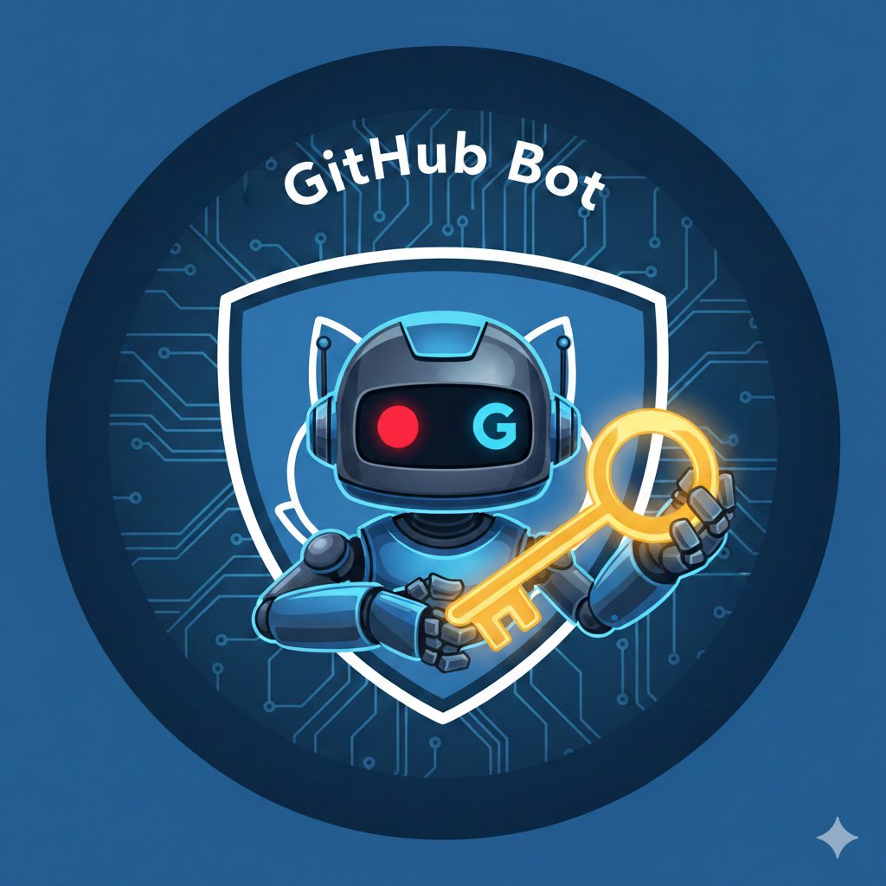

# GitHub Bot



[](https://sonarcloud.io/summary/new_code?id=yonasBSD_github-bot)
[](https://sonarcloud.io/summary/new_code?id=yonasBSD_github-bot)
[](https://sonarcloud.io/summary/new_code?id=yonasBSD_github-bot)
<!--[](https://codecov.io/gh/yonasBSD/github-bot)-->
<!--[](https://github.com/yonasBSD/github-bot/pkgs/container/github-bot)-->
<!--[](https://hub.docker.com/r/github-bot/example)-->
<!--[](https://quay.io/repository/github-bot/example)-->


[](https://deps.rs/repo/github/yonasBSD/github-bot)

[](https://github.com/yonasBSD/github-bot/releases/latest)
[](https://github.com/yonasBSD/github-bot/blob/main/LICENSE.txt)
<!--[](https://matrix.to/#/#vaultwarden:matrix.org)-->

A GitHub bot for your terminal.

Integrates [ghk](https://github.com/bymehul/ghk) with custom commands, and plugins with built-in [Rhai scripting](https://github.com/rhaiscript/rhai).

## Features
- plugin infrastructure
  - built-in custom [Rhai scripting](https://github.com/yonasBSD/rhai/tree/feat/stdlib)
    - support for [ruviz scientific graph plotting](https://github.com/Ameyanagi/ruviz)
      - High-performance 2D plotting library for Rust combining matplotlib's ease-of-use with Makie's performance
    - file system access
    - [env.rs](https://github.com/yonasBSD/env.rs)
      - automatically read `.env`, `.env.$APP_ENV`, and `.env.local` files
    - running shell commands
    - working with JSON, YAML, and TOML files
- custom commands
  - maintain :: Maintain one or more repositories (cleanup, rerun, or release)
  - merge :: Merge Dependabot PRs for a specific repository
  - wip :: Work-in-progress commit helper
- [ghk](https://github.com/bymehul/ghk) integration

| Command | Alias | Purpose | Runs... |
|---------|-------|---------|---------|
| `setup` | | Install requirements | (Checks requirements) |
| `init` | | Start tracking folder | `git init` |
| `login` / `logout` | | GitHub auth | `gh auth login` |
| `create` | | Create repo on GitHub | `gh repo create` |
| `push` | `save` | Save changes | `git add -A && git commit && git push` |
| `pull` | `sync` | Download changes | `git pull` |
| `clone <repo>` | `download` | Download repo | `gh repo clone` |
| `status` | | Show status | `git status` |
| `diff` | | Preview changes | `git diff` |
| `history` | `log` | Show recent saves | `git log` |
| `undo` | | Undo last commit | `git reset --soft HEAD~1` |
| `open` | | Open in browser | `gh browse` |
| `branch` | | List/switch branches | `git branch` |
| `ignore` | | Add .gitignore | (Writes .gitignore) |
| `license` | | Add license file | (Writes LICENSE) |
| `config` | | View/edit settings | (Edits config) |
| `user list/switch` | | Manage accounts | (Internal auth) |
| `completions` | | Shell completions | (Generates script) |

## Help

```console
GitHub automation bot

Usage: github-bot [OPTIONS] <COMMAND>

Commands:
  maintain  Maintain one or more repositories (cleanup, rerun, or release)
  merge     Merge Dependabot PRs for a specific repository
  wip       Work-in-progress commit helper. Push all uncommitted changes using the last commit
  git       Simple GitHub helper. Push code without the complexity
  hello     Ping test
  help      Print this message or the help of the given subcommand(s)

Options:
  -t, --token <TOKEN>  Optional GitHub Personal Access Token (PAT) with 'repo' scope. If not provided, the program will look for the `GITHUB_TOKEN` environment variable
  -q, --quiet          Suppress output (errors still shown)
  -v, --verbose...     Increase logging verbosity
  -q, --quiet...       Decrease logging verbosity
      --nocolor        Disable colored output
  -h, --help           Print help
  -V, --version        Print version
```
